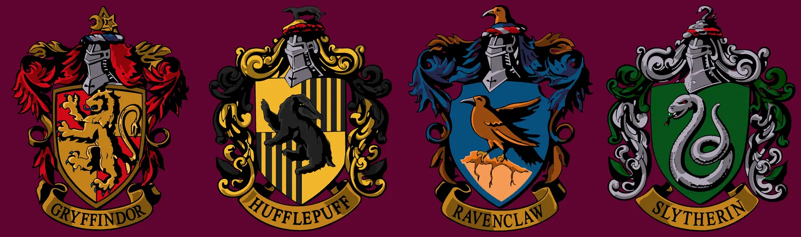
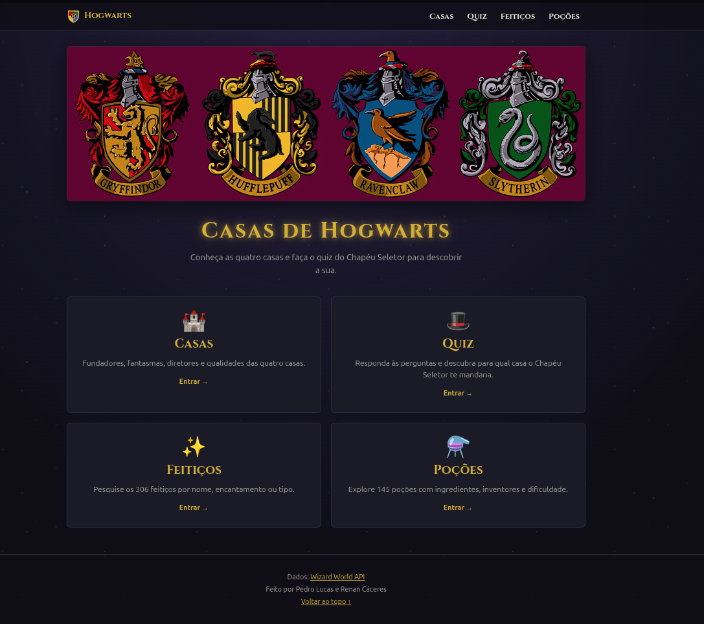

# 🪄 Casas de Hogwarts

<p align="center">
  
</p>

<p align="center">
  <strong>Projeto 1 — Disciplina de FullStack</strong><br>
  Universidade Tecnológica Federal do Paraná — UTFPR
</p>

<p align="center">
  🏰 React &nbsp;•&nbsp; ✨ Wizard World API &nbsp;•&nbsp; 🎨 styled-components
</p>

---

## 🎓 Contexto acadêmico

Projeto desenvolvido para a disciplina de **FullStack** da **Universidade Tecnológica Federal do Paraná (UTFPR)**, como parte do **Projeto 1**, ministrado pela:

**Profª. Drª. Juliana Costa Silva**
📧 [julianacsilva@utfpr.edu.br](mailto:julianacsilva@utfpr.edu.br)
🔗 [github.com/costasilvati](https://github.com/costasilvati)

### 👨‍💻 Autores

| Integrante                   | Participação                                                                                                           |
| ---------------------------- | ---------------------------------------------------------------------------------------------------------------------- |
| **Pedro Lucas Sales Larini** | Desenvolvimento das funcionalidades, interface, animações, integração com feitiços e poções e organização das páginas. |
| **Renan Cáceres Anselmo**    | Configuração inicial, integração com a API, listagem das casas, quiz, ampliação das perguntas, documentação e deploy.  |

A divisão detalhada das tarefas está disponível no [`PLANO.md`](./PLANO.md).

---

## 🏰 Sobre o projeto

**Casas de Hogwarts** é uma aplicação web desenvolvida em **React** que utiliza a **Wizard World API** para apresentar informações sobre o universo de Harry Potter de forma interativa.

O projeto permite:

* 🏰 Explorar as quatro casas de Hogwarts;
* 🎩 Descobrir sua casa através de um quiz;
* ✨ Consultar feitiços;
* ⚗️ Explorar poções;
* 🔎 Pesquisar e filtrar informações;
* 📱 Utilizar a aplicação em diferentes tamanhos de tela.

A interface foi desenvolvida com uma identidade visual inspirada no universo mágico, utilizando animações, cores das casas e elementos temáticos.

---

## 🌐 Links

<p align="center">

[](https://github.com/RenanCaceres/Projeto1-FullStack)

[](https://projeto1-full-stack.vercel.app)

</p>

**Repositório:**
https://github.com/RenanCaceres/Projeto1-FullStack

**Aplicação:**
https://projeto1-full-stack.vercel.app

---

## ⚡ Tecnologias

* **React**
* **JavaScript**
* **Vite**
* **styled-components**
* **Axios**
* **Vercel**

### React

Entre os recursos do React utilizados estão:

| Recurso                  | Utilização                       |
| ------------------------ | -------------------------------- |
| `useReducer`             | Gerenciamento do estado do quiz  |
| `useMemo`                | Memorização do resultado do quiz |
| `memo`                   | Otimização dos cards das casas   |
| `useState` / `useEffect` | Estados e efeitos da aplicação   |
| `useApi`                 | Hook próprio para chamadas à API |
| `useDebounce`            | Controle das pesquisas           |
| `useRota`                | Navegação entre páginas          |

---

## 🔮 Wizard World API

A aplicação utiliza a **Wizard World API** como fonte de dados.

Os principais endpoints utilizados são:

| Endpoint   | Utilização        |
| ---------- | ----------------- |
| `/Houses`  | Casas de Hogwarts |
| `/Spells`  | Feitiços          |
| `/Elixirs` | Poções            |

A comunicação com a API é centralizada em:

```text
src/services/hogwartsService.js
```

🔗 [Documentação da Wizard World API](https://wizard-world-api.herokuapp.com/swagger/index.html)

---

## 🎨 styled-components

O projeto utiliza **styled-components** para construção da interface, permitindo criar componentes estilizados diretamente no React.

Também são utilizados:

* `ThemeProvider`;
* `createGlobalStyle`;
* `keyframes`;
* Tema centralizado;
* Animações;
* Responsividade.

---

## 🤖 Ferramentas de apoio

Durante o desenvolvimento foram utilizadas ferramentas de **Inteligência Artificial** como apoio ao processo de desenvolvimento.

A IA foi utilizada principalmente para:

* Auxiliar na criação e refinamento de animações CSS;
* Sugerir soluções utilizando `styled-components`;
* Apoiar ideias de organização visual e experiência do usuário;
* Auxiliar na documentação;
* Explicar e revisar soluções técnicas.

As animações que receberam auxílio de IA foram identificadas no código através do comentário:

```js
// Animação feita com auxílio de IA (Claude)
```

A utilização da IA ocorreu como **ferramenta de apoio**, com as sugestões sendo analisadas e adaptadas pelos integrantes do projeto.

---

## 🚀 Como executar

### Pré-requisitos

* Node.js
* npm
* Git

### Instalação

Clone o repositório:

```bash
git clone https://github.com/RenanCaceres/Projeto1-FullStack.git
cd Projeto1-FullStack
```

Instale as dependências:

```bash
npm install
```

Execute o projeto:

```bash
npm run dev
```

A aplicação estará disponível em:

```text
http://localhost:5173
```

### Build de produção

```bash
npm run build
```

---

## 🖥️ Preview

<p align="center">
  
</p>

---

## 🧙‍♂️ Resultado

O projeto reúne conceitos de **desenvolvimento frontend, consumo de APIs, componentização, gerenciamento de estado, estilização, responsividade e deploy**, transformando os dados da Wizard World API em uma experiência interativa inspirada no universo de Hogwarts.

---

<p align="center">

### ✨ Feito com React e um pouco de magia. ✨

**Pedro Lucas Sales Larini · Renan Cáceres Anselmo**

</p>

<p align="center">
  <a href="https://projeto1-full-stack.vercel.app">🌐 Acessar aplicação</a>
  •
  <a href="https://github.com/RenanCaceres/Projeto1-FullStack">💻 GitHub</a>
</p>
